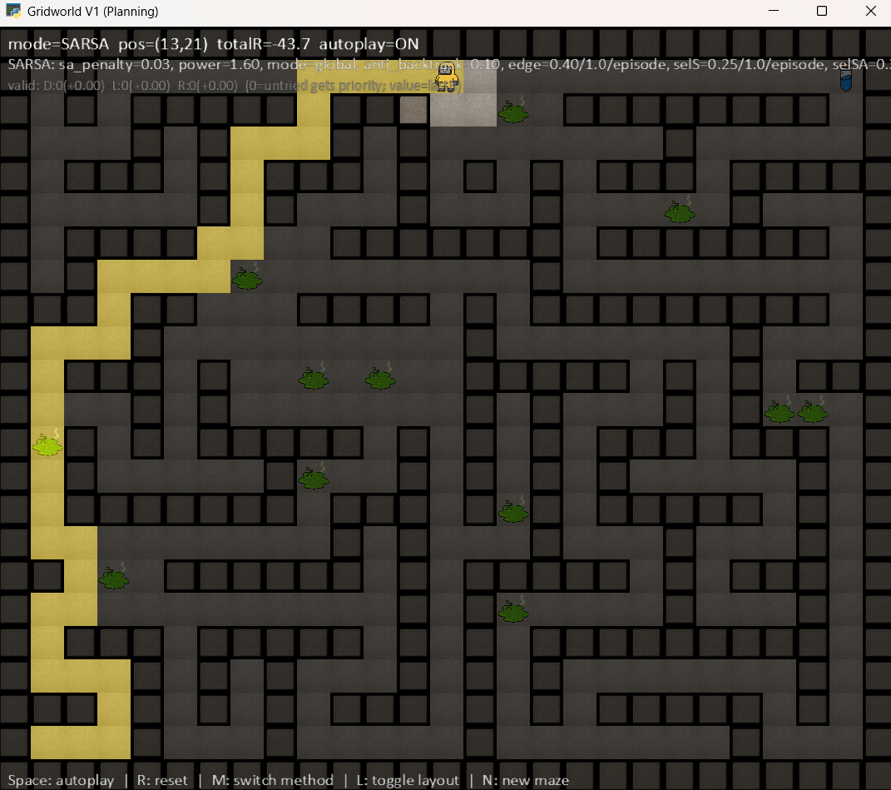

<p align="left">
  
  
  
  
</p>

Acid Puddles is a visual Reinforcement Learning sandbox focused on danger‑avoidance behaviors in a 2D Gridworld with acid puddles. The agent seeks the goal while minimizing cost, learning to detour around hazards that allow traversal but penalize reward.

Project brief and motivation: [Notion — Acid Puddles: danger avoidance](https://www.notion.so/pedro-bento/3-Acid-Puddles-danger-avoidance-279e026f6b2d8043b793d9f587259a3a)

## 🎮 Overview

- Deterministic 2D grid with borders and interior walls (corridor or procedural maze).
- States `(x, y)` and actions `UP`, `DOWN`, `LEFT`, `RIGHT`.
- Non‑blocking hazards (acid puddles) impose a negative reward when stepped on.
- Optional detours are carved around on‑path puddles to make avoidance feasible.
- Methods available in real time:
  - VI (Value Iteration)
  - PI (Policy Iteration)
  - SARSA (on‑policy TD control)

## 🧪 Rewards & hazards

- `step`: per‑step cost (negative)
- `goal`: terminal reward upon reaching the goal
- `collision`: cost when a move is blocked by walls/border
- `hazard`: extra penalty if the next state is a puddle (movement allowed)

These are configurable in `config/gridworld_v1.json`.

## ✨ What’s special here

- **Acid puddles as soft obstacles**: Never block movement; only penalize reward.
- **Detour carving**: For maze layouts, side‑lanes are carved around selected pud­dles so the shortest path can be avoided with minimal extra cost.
- **Planning + Learning**: Compare VI/PI (model‑based) vs. SARSA (interaction‑based) on the same map.
- **Yellow & gray UI**: Minimal, legible palette tuned for clarity (yellow highlights, gray tiles).

## 🗂️ Project structure

```
RL-Acid-Puddles/
├── README.md
├── LICENSE
├── assets/images/
│   ├── actor.png
│   ├── exit.png
│   ├── floor.png
│   ├── wall.png
│   └── obstacles.png
├── config/
│   ├── gridworld_v1.json
│   └── methods/
│       └── sarsa.json
├── requirements-312.txt
├── scripts/
│   └── gridworld_v1_arcade.py
└── src/
    ├── agents/
    │   ├── policy_iteration.py
    │   ├── sarsa.py
    │   └── value_iteration.py
    ├── engine/
    │   └── gridworld_renderer.py
    └── envs/
        └── gridworld_v1.py
```

## Requirements

- Python 3.10+ (3.12 recommended)
- `arcade==3.0.0`, `numpy>=2.0,<3` (see `requirements-312.txt`)

## Setup (PowerShell)

```powershell
python -m venv .venv
./.venv/Scripts/Activate.ps1
pip install -r requirements-312.txt
```

## ▶️ Run

```powershell
python -m scripts.gridworld_v1_arcade
```

The UI loads `config/gridworld_v1.json`, applies the configured `method` (`vi` | `pi` | `sarsa`), and if `sarsa` is selected, reads hyperparameters from `config/methods/sarsa.json`.

## ⌨️ Controls

- Space — toggle autoplay
- R — reset episode
- M — switch method (VI → PI → SARSA → VI)
- L — toggle layout (corridor ↔ maze)
- N — new maze (procedural)

## ⚙️ Key configuration

`config/gridworld_v1.json` (excerpt):

```json
{
  "layout": "maze",
  "method": "vi",
  "rewards": { "step": -1, "goal": 10, "collision": -5, "hazard": -4 },
  "obstacles_count": 12,
  "obstacles_on_path_ratio": 0.5,
  "detour_ratio": 0.8
}
```

Notes:
- Increase `hazard` magnitude (e.g., −6/−10) to make planners avoid puddles more strongly.
- `detour_ratio` controls how many on‑path puddles get a bypass carved in maze mode.

## 📚 References

- Sutton & Barto — Reinforcement Learning: An Introduction
- Arcade 3.x documentation

## 📝 License

Released under The Unlicense (public domain). See `LICENSE` or [unlicense.org](https://unlicense.org).


